# Stevinsluizen Example (Unsteady Lock Operation)

This example simulates salt intrusion and water exchange through the **Stevinsluis** at Den Oever (connecting the saline Waddenzee to freshwater Lake IJsselmeer) across three BIVAS traffic scenarios:
- **2023** (BIVAS reference year)
- **2050 HSK** (Hoog-Steil klimaatscenario)
- **2050 LVK** (Laag-Vlak klimaatscenario)

An interactive HTML overview is available in [index.html](index.html).

---

## Workflow Diagram



### D2 Source Specification (`workflow.d2`)

```d2
direction: right

title: Stevinsluizen Salt Intrusion Simulation Workflow {
  near: top-center
  shape: text
  style.font-size: 24
  style.bold: true
}

classes: {
  dataset: {
    shape: cylinder
    style: {
      fill: "#e0f2fe"
      stroke: "#0284c7"
      stroke-width: 2
    }
  }
  process: {
    shape: rectangle
    style: {
      fill: "#f8fafc"
      stroke: "#334155"
      stroke-width: 2
      border-radius: 8
    }
  }
  phase: {
    shape: rectangle
    style: {
      fill: "#ecfdf5"
      stroke: "#059669"
      stroke-width: 2
      border-radius: 6
    }
  }
  output_node: {
    shape: page
    style: {
      fill: "#fef3c7"
      stroke: "#d97706"
      stroke-width: 2
    }
  }
}

inputs: "1. Data Inputs & Geometry" {
  bivas: "BIVAS Traffic Data\n(Stevin_ZSF_Lockages.xlsm)" {
    class: dataset
    tooltip: "Leveling events, ship counts, water levels, durations for 2023, 2050HSK, 2050LVK"
  }
  fis: "FIS Schematization\n(Zenodo: 20793663)" {
    class: dataset
    tooltip: "Chamber: 120m x 13.5m, Sill: NAP -3.5m, Bottom: NAP -4.0m"
  }
  bc: "Boundary Conditions" {
    class: dataset
    tooltip: "Lake (IJsselmeer): 1.0 kg/m³ | Sea (Waddenzee): 28.0 kg/m³ | T: 15°C"
  }
}

prep: "2. Conversion & Preprocessing" {
  extract: "Extract Lockage Cycles\n(CSV Generation)" {
    class: process
    description: "time, head_sea, routine (1-4), ship_volumes, t_level, t_open"
  }
}

simulation: "3. D-SLF Unsteady Simulation Engine (pyzsf)" {
  style.fill: "#f1f5f9"
  
  init: "ZSFUnsteady Initialization\n(Length: 120m, Width: 13.5m, Sill: -3.5m)" {
    class: process
  }

  cycle: "Phase-wise Lock Cycle (Routine 1 to 4)" {
    p1: "Routine 1: Leveling to Lake\nstep_phase_1(t_level, head_sea)" {
      class: phase
    }
    p2: "Routine 2: Doors Open Lake\nstep_phase_2(t_open_lake, ship_vol_lake_to_sea)" {
      class: phase
    }
    p3: "Routine 3: Leveling to Sea\nstep_phase_3(t_level, head_sea)" {
      class: phase
    }
    p4: "Routine 4: Doors Open Sea\nstep_phase_4(t_open_sea, ship_vol_sea_to_lake)" {
      class: phase
    }

    p1 -> p2 -> p3 -> p4
    p4 -> p1: "Next cycle" {
      style.stroke-dash: 4
    }
  }

  init -> cycle.p1
}

analysis: "4. Aggregation & Scenario Outputs" {
  timeseries: "Step-by-Step Transports\n(results_stevinsluizen_<scenario>.csv)" {
    class: output_node
  }
  summary: "Annual Scenario Summary\n(summary_scenarios.csv)" {
    class: output_node
    description: "Net salt flux (kg/s), total salt load (tonnes), discharges (m³/s)"
  }
}

inputs.bivas -> prep.extract: "Sheet parsing"
inputs.fis -> simulation.init: "Lock dimensions"
inputs.bc -> simulation.init: "Salinity & Water levels"

prep.extract -> simulation.cycle: "Sequential lockage events"

simulation.cycle -> analysis.timeseries: "Per-phase transports"
simulation.cycle -> analysis.summary: "Annual integration"
```

---

## Lock Geometry & Specifications

From the FIS network dataset and lock schematizations ([Zenodo record 20793663](https://zenodo.org/records/20793663)):
- **Lock chamber**: Sluiskolk Stevinsluis (Id: 8988, Lock Id: 43389)
- **Chamber Length**: 120.0 m
- **Chamber Width**: 13.5 m (gate width 13.0 m, surface area 1,620 m²)
- **Sill Depth (Sea & Lake)**: NAP −3.5 m
- **Lock Bottom**: NAP −4.0 m (effective sill height = 0.5 m)
- **Operating Constraint**: No locking above NAP +1.80 m

## Boundary Conditions

- **Lake Side (IJsselmeer)**: Freshwater, level reference `head_lake = 0.0 m`, salinity = 1.0 kg/m³, temperature = 15.0 °C.
- **Sea Side (Waddenzee)**: Dynamic tidal head difference `head_sea` per lockage from BIVAS water levels, salinity = 28.0 kg/m³, temperature = 15.0 °C.

---

## Files

- [Stevin_ZSF_Lockages.xlsm](Stevin_ZSF_Lockages.xlsm): Original workbook containing BIVAS lockages and the VBA converter `Convert_LogLocksLeveling_To_ZSF`.
- [case.md](case.md): Overview of the ZSF input columns and definitions.
- [workflow.d2](workflow.d2): D2 diagram source script defining the complete model workflow.
- [workflow.svg](workflow.svg): Rendered workflow diagram.
- [index.html](index.html): Self-contained interactive HTML document presenting the model setup, diagram, and results.
- [lockages_bivas_2023.csv](lockages_bivas_2023.csv): 2023 lock cycles input data.
- [lockages_bivas_2050hsk.csv](lockages_bivas_2050hsk.csv): 2050 HSK lock cycles input data.
- [lockages_bivas_2050lvk.csv](lockages_bivas_2050lvk.csv): 2050 LVK lock cycles input data.
- [run_stevinsluizen.py](run_stevinsluizen.py): CLI simulation script using `pyzsf`.

---

## Simulation Results

| Scenario | Simulated Steps | Duration (days) | Annual Salt Load to Lake (tonnes) | Avg Salt Flux to Lake (kg/s) | Avg Discharge to Lake (m³/s) | Flow-Weighted Salinity (kg/m³) |
| :--- | :--- | :--- | :--- | :--- | :--- | :--- |
| **2023 Reference** | 18,922 | 364.2 | **−484,135** | **−15.38** | 0.773 | 20.78 |
| **2050 HSK** | 18,942 | 363.8 | **−480,834** | **−15.30** | 0.763 | 20.93 |
| **2050 LVK** | 18,614 | 364.4 | **−477,252** | **−15.16** | 0.756 | 20.93 |

---

## Running the Simulation

Using `uv`:

```bash
# Run 2023 scenario
uv run python examples/stevinsluizen/run_stevinsluizen.py --scenario 2023

# Run all scenarios (2023, 2050hsk, 2050lvk)
uv run python examples/stevinsluizen/run_stevinsluizen.py --scenario all

# Re-compile the D2 diagram
d2 examples/stevinsluizen/workflow.d2 examples/stevinsluizen/workflow.svg
```

Outputs are saved in `examples/stevinsluizen/output/`:
- `results_stevinsluizen_<scenario>.csv`: Per-step volumes, discharges, and salinities.
- `summary_scenarios.csv`: Annual aggregates, net salt fluxes, and discharge totals.
